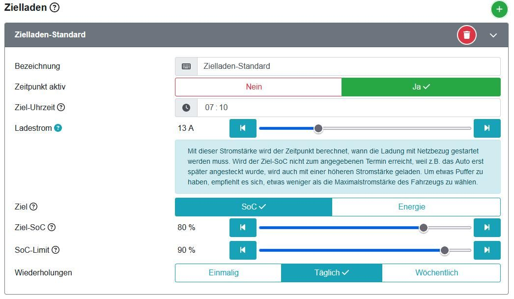

#Typische Anwendungsfälle
## Privater Haushalt, ein E-Auto und PV-Anlage
In diesem Szenario sind die Ziele meistens das Auto morgens für den Weg zur Arbeit fahrbereit zu haben, aber bis dahin möglichst viel Energie aus der PV-Anlage zum Laden zu nutzen.
Hierfür ist die Funktion *Zielladen* zu nutzen. Auch, wenn es vom Namen her scheint, dass nur zu einem festen Zeitpunkt eine definierte Energiemenge in das EV geladen sein soll, wird dennoch bis zum Beginn dieses erzwingenen Ladevorgangs PV-Energie, sofern vorhanden, genutzt. 

Einstellbar ist der Ziel SoC, der in vielen Fällen auf 80% eingestellt wird, da eine höhere Ladung den Akku des EV überproportional belastet. Dennoch sollte ab und zu der Akku auf 100% geladen und dort über kurze Zeit gehalten werden, damit die Zellen sich wieder balancieren können. 
In dem oben gezeigten Beispiel ist der Ladestrom mit 13A eingestellt. Somit bleibt bei einem 3-phasigen 11kW-Lader noch Reserve, um die Stromstärke kurz vor Ende ggf. noch zu erhöhen.

Als Zielzeit ist die Abfahrtzeit Abfahrt einzustellen. Die Regelung berechnet aus dem aktuellen SoC des Fahrzeugs, sowie aus den zwingend korrekt anzugebenden Maximalwerten der Ladeströme im Ladeprofil, den Zeitpunkt, an dem die Ladung starten muss. 
Es empfielt sich den Ladestrom im Ladeprofil unter Zielladen etwas niedriger als die Möglichkeiten der Wallbox und des Fahrzeugs anzugeben, damit etwas Puffer vorhanden ist, falls da Auto zu spät angesteckt worden ist.

Falls das EV durch eine Standheizung vor Fahrtbeginn vorgeheizt werden soll, kann hierfür ein Zeitslot mit _Laden nach Zeitplan_ an das Zielladen angehängt werden. So wird der Akku durch die Standheizung nicht belastet, sondern der Strom kommt aus dem EVU-Netz. Hier kann dann ein minimaler Strom von z.B. 6A gewählt werden, da die Leistungsaufnahme für die Heizung meist nicht mehr als 1kW benötigt. 

###Außerplanmäßige Fahrt
Wird das Fahrzeug außer der Reihe benötigt und es soll kurzfristig viel Energie in den Akku geladen werden, ist die OpenWB auf der Startseite auf *Sofortladen* zu stellen. Hier ist es möglich, mit der maximal verfügbaren Leistung den Akku so schnell wie möglich aufzuladen.

### Ausnutzen der PV-Anlage bei wechseldem Wetter
Insbesondere im Frühling und Herbst, kann die PV-Leistung bei bewölktem Himmel stark schwanken. Um ein häufiges Beenden und Starten des Ladevorgangs zu vermeiden, kann bei dem Modus PV ein *Minimaler Dauerstrom* eingestellt werden.  
Ist die Einstellung auf 0A, so wird ausschließlich mit solarem Überschuss geladen. Mit der nächstgrößeren Einstllmöglichkeit 6A, wird (z.B. bei einphasigem Laden) kontinuierlich mit ~1,3kW geladen. Steigt die Netzeinspeisung über den in _Konfiguration->Ladeeinstellungen ->PV-Laden_ eingestellten Grenzwert, wird die Ladeleistung hochgeregelt und, je nach Möglichkeiten des OBC, auf 3-phasiges Laden umgeschaltet. 

##Integration in Hausautomation
OpenWB eignet sich hervorragend zur Integration in eine bestehende Hausautomatins-Infrastruktur, da über den integrierten MQTT-Broker Befehle, sowie Statusmeldungen ausgetauscht werden können. 
### MQTT
Zum Debugging empfiehlt sich der Programm [MQTT-Explorer?](http://mqtt-explorer.com/). 
Eine detailierte Erklärung ist auf der [MQTT-Seite](https://github.com/openWB/core/wiki/MQTT) zu finden.